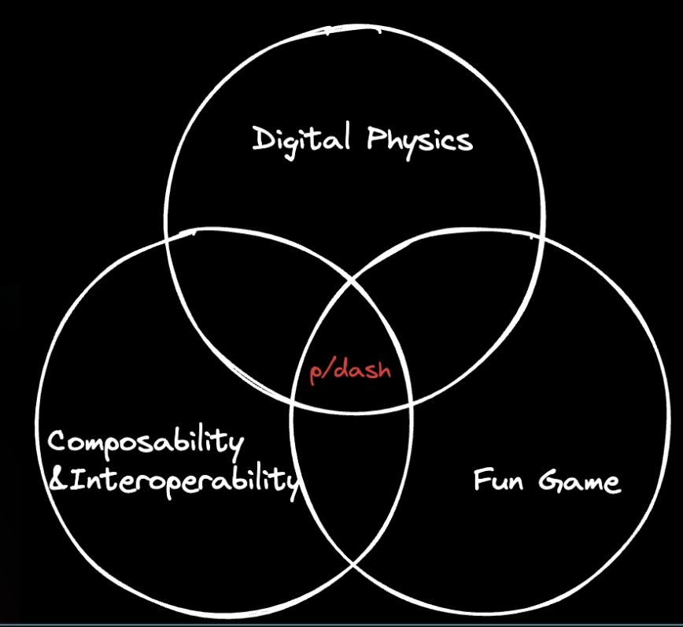
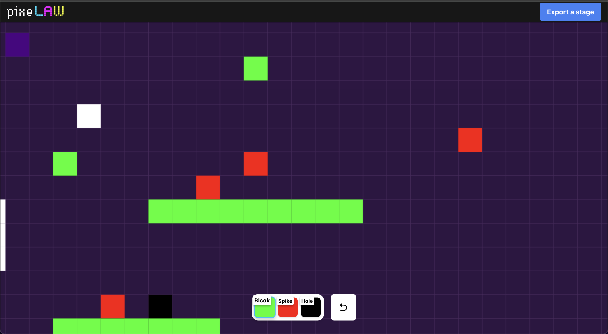

# p/dash

## What is p/dash?
p/dash is a forced-scroll action game built on PixeLAW, inspired by [Geometry Dash](https://geometry-dash.fandom.com/wiki/Geometry_Dash_Wiki).

## Why we build?
We aim to build the first game that incorporates all three of the following elements:

- A digital physics system.
- New experiences such as composability and interoperability.
- An engaging and fun gameplay experience.

By integrating these elements, we aim to attract web2 gamers and create a situation where they must interact with blockchain technology to gain new experiences. When that time comes, the first blockchain they will encounter will be [Starknet](https://www.starknet.io/).



## How to play?
WIP

## Getting Started

### Contracts

1. Check versions of Scarb and Dojo and Cairo

```zsh
$ sozo --version                                                                               
sozo 0.7.0-alpha.2
scarb: 2.6.4
cairo: 2.6.3
sierra: 1.5.0

$ scarb --version       
scarb 2.6.4 (c4c7c0bac 2024-03-19)
cairo: 2.6.3 (https://crates.io/crates/cairo-lang-compiler/2.6.3)
sierra: 1.5.0
```

2. Run .devcontainer
Open this project with vscode, and run [.devcontainer](https://code.visualstudio.com/docs/devcontainers/containers).

3. Set up contracts.
Please check if the container is already up.
```zsh
$ cd ./packages/contracts
$ sozo test
$ scarb run initialize
```

### Frontend to create a stage.
1. Change directory:
```zsh
$ cd <path-to-packages>/pixelaw_client
```

2. Install
```zsh
$ pnpm i
```

3. Run the frontend for pixelaw side.
```zsh
$ pnpm run dev --port 9000
```

4. Make a Stage (WIP)
Please place objects to create  a stage.


<!-- 5. Export a Json file (WIP)
 -->

### Frotend to play a game.
1. Install dependencies.
```zsh
$ pnpm i
```

2. Run the frontend to play.
```zsh
$ pnpm run dev
```

### Trouble Shooting
- Strongly recommend to use chrome's incognito mode.
- When I change dir name dojo-starter to contracts
  - I should've rename `dojo-starter` to `contracts` in source files
  - Then remove `contracts/manifests` and `sozo migrate plan` to re-generate them
  - Then in the `client` dir, run `pn components` to re-generate clientComponents
- When using alpha verison of Dojo, Language Server may not work correctly
  - Downgrade to beta version of Dojo

## How we buid?
Our project is a lightweight WebGL game built with React and Phaser, aiming to enhance UX by delivering it to users as a PWA. The on-chain components are built with Starknet and the Dojo Framework, and this project functions as an application on the PixeLAW Protocol.

## Tech stacks.
- [React](https://react.dev/)/[Vite](https://vitejs.dev/): to build a PixeLAW frontend.
- [Phaser](https://phaser.io/): to build a game client.
- [PWA](https://en.wikipedia.org/wiki/Progressive_web_app): to provide proggressive application.
- [Dojo Framework](https://book.dojoengine.org/): to write contracts in ECS.
  - [slot](https://book.dojoengine.org/toolchain/slot): to deploy.
- [PixeLAW](https://www.pixelaw.xyz/): to get a degital physics, composability and interoperability.

## Future plans.
This project holds great potential, and we plan to continue building it even after the hackathon. Our future expansions include the following ideas:

- Enhancing the gaming experience: We aim to provide a gaming experience equal to or better than existing web2 games. To achieve this, we will first focus on improving the UI/UX.
- Hosting stage co-creation events: We plan to organize events where participants can collaboratively create a stage on PixeLAW over a set period.
- Exploring composability: We aim to allow users to automatically add new objects and create betting functions on top.
- Exploring interoperability: PixeLAW will enable interaction with stages created by other applications and players, leading to new experiences.
- Exploring different games: It is also possible to create objects like stages on PixeLAW and explore the potential of off-chain gameplay. For example, action games similar to Mario could be considered.